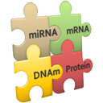

# InCroMap

**Integrated analysis of Cross-platform MicroArray and Pathway data**

*Authors:* [Clemens Wrzodek](https://github.com/Clemens82/), [Johannes Eichner](https://github.com/jeichner/), [Andreas Dräger](https://github.com/draeger/), Finja Wrzodek, Lars Rosenbaum, [Michael Römer](https://github.com/mroemer/), and [Andreas Zell](https://github.com/ZellTuebingen/)

___________________________________________________________________________________________________________

### Short description
Have you ever tried to integrate omics data from different biological layers? InCroMAP is a powerful, easy-to-use high-level cross-platform microarray dataset analysis tool. It provides several methods to analyze or visualize single datasets, as well as methods to perform integrated cross-platform analysis. Currently, mRNA, miRNA (microRNA), DNA methylation and protein (modification) data are supported. InCroMAP can, for example, visualize all platforms at once in a pathway, provide detailed information, e.g., about promoter methylation or perform integrated mRNA and microRNA analysis. In general, InCroMAP is a tool for general or pathway-based analysis and visualization of heterogeneous, cross-platform datasets.

### Publications

Article citations are **critical** for us to be able to continue support for InCroMap.  If you use InCroMap and you publish papers about work that uses InCroMap, we ask that you **please cite the most recent InCroMap paper** and possibly further manuscripts about this tool:

1. Johannes Eichner, Lars Rosenbaum, Clemens Wrzodek, Hans-Ulrich Häring, Andreas Zell, and Rainer Lehmann. [Integrated enrichment analysis and pathway-centered visualization of metabolomics, proteomics, transcriptomics, and genomics data by using the InCroMAP software](http://www.sciencedirect.com/science/article/pii/S1570023214002682).
  Journal of Chromatography B, May 2014. [ [DOI](http://dx.doi.org/10.1016/j.jchromb.2014.04.030) ]
2. Clemens Wrzodek. [Inference and integration of biochemical networks with multilayered omics data](http://www.dr.hut-verlag.de/978-3-8439-1116-0.html). PhD thesis, University of Tuebingen, Tübingen, Germany, June 2013.
3. Clemens Wrzodek, Johannes Eichner, Finja Büchel, and Andreas Zell. [InCroMAP: Integrated analysis of Cross-platform MicroArray and Pathway data](http://bioinformatics.oxfordjournals.org/content/29/4/506). Bioinformatics, 29(4):506-508, December 2012. [ <a href="http://dx.doi.org/10.1093/bioinformatics/bts709">DOI</a> | <a href="http://bioinformatics.oxfordjournals.org/content/29/4/506.full.pdf">PDF</a> ]
4. Clemens Wrzodek, Johannes Eichner, and Andreas Zell. [Pathway-based visualization of cross-platform microarray datasets](http://bioinformatics.oxfordjournals.org/content/28/23/3021). Bioinformatics, 28(23):3021-3026, September 2012. [ [DOI](http://dx.doi.org/10.1093/bioinformatics/bts583) | [PDF](http://bioinformatics.oxfordjournals.org/content/28/23/3021.full.pdf) ]
